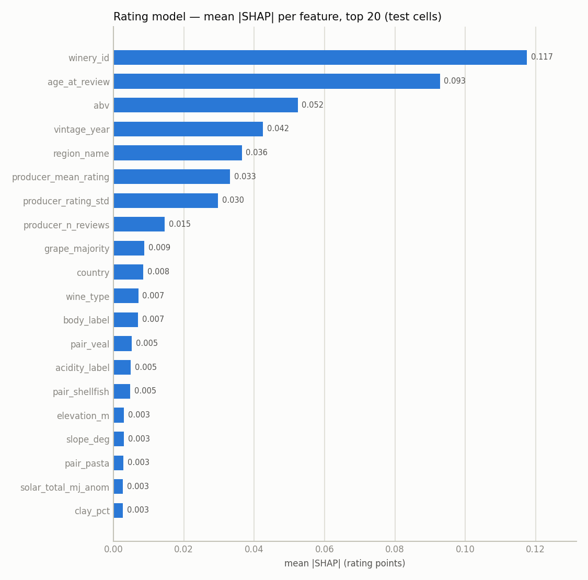
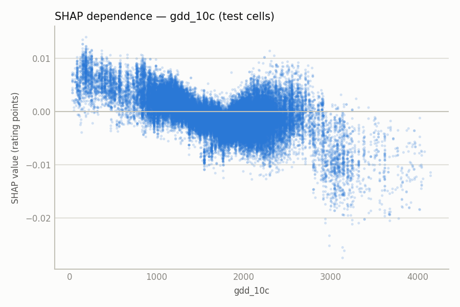
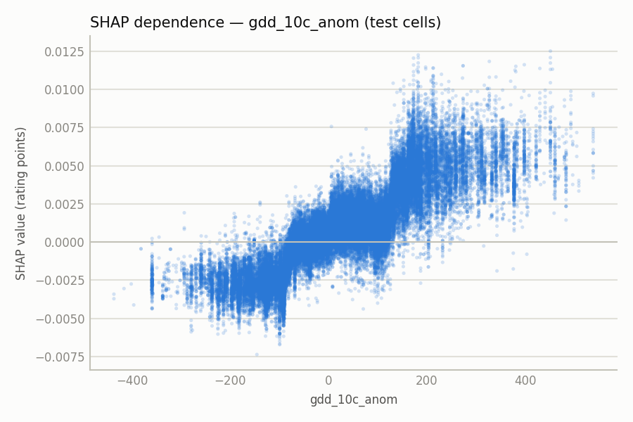
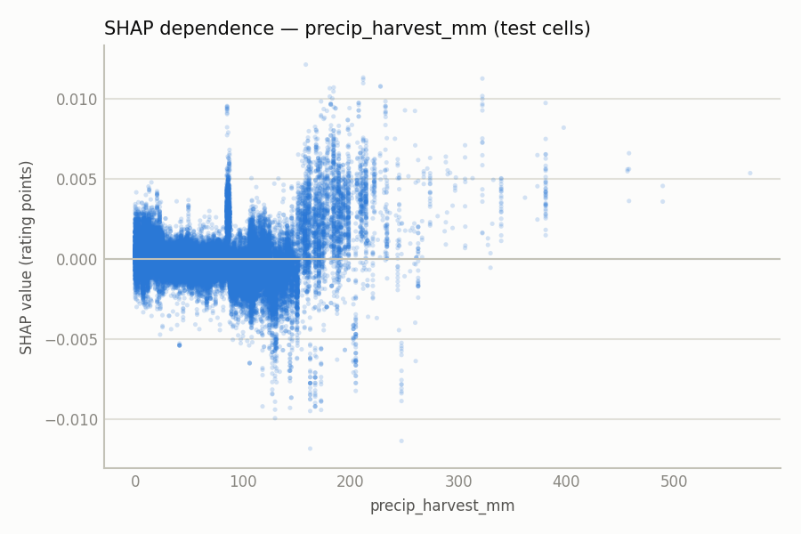
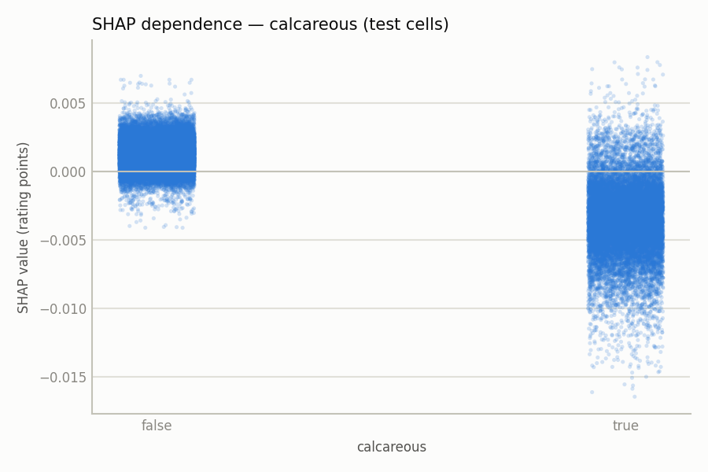

# Vininator 3000 - Results

> Generated by `scripts/build_results.py` from the trained model bundles and recommendation parquets - do not hand-edit; edit the generator. Models trained at git `4c5088a` (dataset `a05e6ead31dc5279`); regenerated at git `a71a998`.

---

## 1. Headline: the picks

**Top drink-now bottles (2026, all monogrape wines):**
| Winery | Wine | Region | Vintage | Predicted (lo-hi) | Body | Acidity | Pairings |
| --- | --- | --- | --- | --- | --- | --- | --- |
| Cartuxa | Pêra-Manca Tinto | Evora | 2011 | 5.01 (4.47-5.01) | Full-bodied | High | beef, veal, poultry, lamb, pasta |
| Cartuxa | Pêra-Manca Tinto | Evora | 2012 | 5.00 (4.48-5.05) | Full-bodied | High | beef, veal, poultry, lamb, pasta |
| Cartuxa | Pêra-Manca Tinto | Evora | 2013 | 5.00 (4.51-5.04) | Full-bodied | High | beef, veal, poultry, lamb, pasta |

**Top cellar candidates (rising or late-peaking within 10 years):**
| Winery | Wine | Region | Vintage | Peak yr | Peak | Slope/yr | Trajectory | Clipped |
| --- | --- | --- | --- | --- | --- | --- | --- | --- |
| Domaine de La Romanée-Conti | La Tâche Grand Cru | Côte de Nuits | 2018 | 2036 | 5.08 | +0.011 | rising | false |
| Cartuxa | Pêra-Manca Tinto | Evora | 2014 | 2035 | 5.07 | +0.010 | peaks_late | false |
| Cartuxa | Pêra-Manca Tinto | Evora | 2013 | 2034 | 5.07 | +0.010 | peaks_late | false |

**Biggest overperformers vs. peer baseline:**
| Winery | Wine | Region | Vintage | Predicted | Baseline | Overperf | lo-hi |
| --- | --- | --- | --- | --- | --- | --- | --- |
| Dolle | Cuvée Année | Niederösterreich | 1994 | 3.80 | 2.00 | +1.80 | 2.70-4.88 |
| Warrabilla | Parola's Limited Release Shiraz | North East Victoria | 2018 | 4.54 | 3.17 | +1.37 | 4.26-5.11 |
| Cedar Ridge | Marechal Foch | Iowa | 2013 | 4.05 | 2.71 | +1.34 | 2.98-4.90 |

On held-out wines the rating model reaches a cell-level RMSE of 0.3448, against 0.3978 for the best leakage-safe baseline (winery_mean) - so the rankings clear the best peer average, which is the bar that makes them picks rather than noise.

---

## 2. Setup

- **Dataset variant:** full
- **Wine-split seed:** 42   **model seed:** 42
- **Rating config:** rating_v1
- **Git SHA (models):** 4c5088ade9f5691165de518e560422f160b6159c
- **Dataset hash:** a05e6ead31dc5279
- **Experiment tracking:** MLflow local file store (`mlruns/`, experiment `vininator`); runs are identified by git SHA + dataset hash - a file store has no shareable run links.

**Split sizes:**
| split | ratings | wines | wine_vintages | vintages |
| --- | --- | --- | --- | --- |
| train | 15508214 | 84309 | 746194 | 1950-2018 |
| test | 2675802 | 14877 | 131568 | 1950-2018 |
| future_vintage_test | 2387129 | 79129 | 128449 | 2019-2021 |

---

## 3. Drink-now and age-well rankings

### 3.1 Drink-now (opening year 2026)

Top monogrape wines predicted to drink best in 2026, per grape. Aromatic whites carry a 5-year freshness cap; cellar-style reds do not.

#### Cabernet Sauvignon

```bash
vininator recommend drink-now --grape cabernet-sauvignon --top 10
```

| Winery | Wine | Region | Vintage | Predicted (lo-hi) | Body | Acidity | Pairings |
| --- | --- | --- | --- | --- | --- | --- | --- |
| Hundred Acre | Ark Vineyard Cabernet Sauvignon | Rutherford | 2012 | 4.95 (4.53-4.98) | Very full-bodied | Medium | beef, poultry, lamb, game_meat, hard_cheese |
| Sloan | Asterisk | Rutherford | 2012 | 4.95 (4.52-4.98) | Full-bodied | Medium | beef, lamb, poultry, game_meat, spicy_food |
| Hundred Acre | Kayli Morgan Vineyard Cabernet Sauvignon | Rutherford | 2012 | 4.94 (4.53-4.98) | Very full-bodied | Medium | beef, poultry, lamb, game_meat, hard_cheese |
| Hundred Acre | Few and Far Between Cabernet Sauvignon | Rutherford | 2012 | 4.94 (4.54-4.98) | Very full-bodied | Medium | beef, poultry, lamb, game_meat, hard_cheese |
| Scarecrow | M. Etain | Rutherford | 2012 | 4.94 (4.56-4.98) | Full-bodied | Medium | beef, lamb, poultry, game_meat, maturated_cheese |
| Hundred Acre | Ark Vineyard Cabernet Sauvignon | Rutherford | 2016 | 4.93 (4.73-5.06) | Very full-bodied | Medium | beef, poultry, lamb, game_meat, hard_cheese |
| Harlan Estate | Harlan Estate Red | Oakville | 2012 | 4.93 (4.60-5.02) | Full-bodied | Medium | beef, lamb, poultry, game_meat, spicy_food |
| Diamond Creek | Volcanic Hill Cabernet Sauvignon | Calistoga | 2012 | 4.93 (4.42-5.03) | Very full-bodied | Medium | beef, lamb, poultry, maturated_cheese, hard_cheese |
| Hundred Acre | Ark Vineyard Cabernet Sauvignon | Rutherford | 2010 | 4.93 (4.59-4.99) | Very full-bodied | Medium | beef, poultry, lamb, game_meat, hard_cheese |
| Hundred Acre | Ark Vineyard Cabernet Sauvignon | Rutherford | 2013 | 4.93 (4.53-4.90) | Very full-bodied | Medium | beef, poultry, lamb, game_meat, hard_cheese |

#### Pinot Noir

```bash
vininator recommend drink-now --grape pinot-noir --top 10
```

| Winery | Wine | Region | Vintage | Predicted (lo-hi) | Body | Acidity | Pairings |
| --- | --- | --- | --- | --- | --- | --- | --- |
| Domaine de La Romanée-Conti | La Tâche Grand Cru | Côte de Nuits | 2018 | 4.97 (4.88-5.23) | Medium-bodied | High | veal, poultry, game_meat, beef, pork |
| Domaine de La Romanée-Conti | La Tâche Grand Cru | Côte de Nuits | 2012 | 4.96 (4.62-5.01) | Medium-bodied | High | veal, poultry, game_meat, beef, pork |
| Domaine de La Romanée-Conti | La Tâche Grand Cru | Côte de Nuits | 2009 | 4.96 (4.54-5.00) | Medium-bodied | High | veal, poultry, game_meat, beef, pork |
| Domaine de La Romanée-Conti | La Tâche Grand Cru | Côte de Nuits | 2011 | 4.95 (4.60-5.00) | Medium-bodied | High | veal, poultry, game_meat, beef, pork |
| Domaine de La Romanée-Conti | La Tâche Grand Cru | Côte de Nuits | 2017 | 4.95 (4.80-5.12) | Medium-bodied | High | veal, poultry, game_meat, beef, pork |
| Domaine de La Romanée-Conti | La Tâche Grand Cru | Côte de Nuits | 2010 | 4.95 (4.55-5.00) | Medium-bodied | High | veal, poultry, game_meat, beef, pork |
| Domaine de La Romanée-Conti | La Tâche Grand Cru | Côte de Nuits | 2020 | 4.95 (4.88-5.20) | Medium-bodied | High | veal, poultry, game_meat, beef, pork |
| Domaine de La Romanée-Conti | La Tâche Grand Cru | Côte de Nuits | 2015 | 4.95 (4.75-5.08) | Medium-bodied | High | veal, poultry, game_meat, beef, pork |
| Domaine de La Romanée-Conti | La Tâche Grand Cru | Côte de Nuits | 2013 | 4.93 (4.62-4.99) | Medium-bodied | High | veal, poultry, game_meat, beef, pork |
| Domaine de La Romanée-Conti | La Tâche Grand Cru | Côte de Nuits | 2019 | 4.93 (4.91-5.17) | Medium-bodied | High | veal, poultry, game_meat, beef, pork |

#### Chardonnay

```bash
vininator recommend drink-now --grape chardonnay --max-vintage-age 5 --top 10
```

| Winery | Wine | Region | Vintage | Predicted (lo-hi) | Body | Acidity | Pairings |
| --- | --- | --- | --- | --- | --- | --- | --- |
| Domaine Leflaive | Chevalier-Montrachet Grand Cru | Bourgogne | 2021 | 4.62 (4.21-5.14) | Full-bodied | Medium | pasta, cured_meat, soft_cheese, shellfish, rich_fish |
| Larmandier-Bernier | Terre de Vertus Champagne Premier Cru | Champagne | 2021 | 4.44 (4.15-5.12) | Medium-bodied | High | shellfish, soft_cheese, pork, rich_fish, poultry |
| Rombauer Vineyards | Chardonnay | Los Carneros | 2021 | 4.42 (4.10-4.99) | Full-bodied | Low | rich_fish, vegetarian, poultry, pork, game_meat |
| Louis Jadot-Domaine Gagey | Savigny-lès-Beaune Clos des Guettes Blanc | Bourgogne | 2021 | 4.39 (3.86-5.07) | Full-bodied | Medium | pasta, cured_meat, rich_fish, soft_cheese, shellfish |
| Cave Geisse | Blanc de Blanc Brut | Pinto Bandeira | 2021 | 4.38 (4.02-4.84) | Medium-bodied | High | shellfish, pork, rich_fish, soft_cheese, vegetarian |
| Rutini | Trumpeter Chardonnay | Mendoza | 2021 | 4.29 (3.71-4.65) | Full-bodied | High | vegetarian, poultry, rich_fish, pork, game_meat |
| Buitenverwachting | Buiten Blanc | Constantia | 2021 | 4.29 (3.76-4.88) | Full-bodied | High | rich_fish, vegetarian, poultry, pork, shellfish |
| Maso Martis | Blanc de Blancs Brut | Trento | 2021 | 4.28 (3.79-4.98) | Medium-bodied | High | poultry, rich_fish, pork, vegetarian, beef |
| The Calling | Dutton Ranch Chardonnay | Russian River Valley | 2021 | 4.25 (3.89-4.97) | Full-bodied | High | poultry, vegetarian, rich_fish, pork, game_meat |
| Cà dei Frati | Cuvée dei Frati Brut | Lombardia | 2021 | 4.25 (3.89-4.90) | Full-bodied | Medium | rich_fish, vegetarian, pork, poultry, shellfish |

#### Riesling

```bash
vininator recommend drink-now --grape riesling --max-vintage-age 5 --top 10
```

| Winery | Wine | Region | Vintage | Predicted (lo-hi) | Body | Acidity | Pairings |
| --- | --- | --- | --- | --- | --- | --- | --- |
| Duke's | Magpie Hill Reserve Riesling | Mount Barker | 2021 | 4.38 (3.94-4.98) | Light-bodied | High | poultry, cured_meat, pork, shellfish, snack |
| Peter Lauer | Riesling Sekt Brut Réserve | Mosel | 2021 | 4.29 (3.85-5.01) | Light-bodied | High | poultry, lean_fish, snack, appetizer, pork |
| Markus Molitor | Zeltinger Sonnenuhr Riesling Auslese*** | Mosel | 2021 | 4.28 (3.93-4.93) | Light-bodied | High | poultry, pork, cured_meat, shellfish, spicy_food |
| Crawford River | Young Vines Riesling | Henty | 2021 | 4.27 (3.84-4.94) | Light-bodied | High | poultry, pork, snack, appetizer, shellfish |
| Gibson | Riesling | Eden Valley | 2021 | 4.25 (3.77-4.95) | Light-bodied | High | poultry, cured_meat, pork, snack, shellfish |
| Leeuwin Estate | Art Series Riesling | Margaret River | 2021 | 4.22 (3.88-4.96) | Light-bodied | High | poultry, pork, snack, appetizer, cured_meat |
| Dr. Loosen | Dr. L Riesling | Mosel | 2021 | 4.18 (3.89-4.88) | Light-bodied | High | poultry, pork, spicy_food, cured_meat, shellfish |
| Grosset | Polish Hill Riesling | Clare Valley | 2021 | 4.16 (3.70-4.83) | Light-bodied | High | poultry, pork, cured_meat, snack, shellfish |
| Felton Road | Bannockburn Riesling | Central Otago | 2021 | 4.15 (3.84-4.92) | Light-bodied | High | poultry, pork, cured_meat, shellfish, spicy_food |
| Rolf Binder | Riesling | Barossa Valley | 2021 | 4.14 (3.77-4.88) | Light-bodied | High | poultry, pork, shellfish, snack, cured_meat |

#### Nebbiolo

```bash
vininator recommend drink-now --grape nebbiolo --top 10
```

| Winery | Wine | Region | Vintage | Predicted (lo-hi) | Body | Acidity | Pairings |
| --- | --- | --- | --- | --- | --- | --- | --- |
| Berta | Tre Soli Tre Grappa Invecchiata | Piemonte | 2012 | 4.90 (4.37-5.05) | Full-bodied | High | lamb, beef, pasta, game_meat, maturated_cheese |
| Berta | Tre Soli Tre Grappa Invecchiata | Piemonte | 2009 | 4.86 (4.29-5.03) | Full-bodied | High | lamb, beef, pasta, game_meat, maturated_cheese |
| Berta | Tre Soli Tre Grappa Invecchiata | Piemonte | 2010 | 4.86 (4.27-5.03) | Full-bodied | High | lamb, beef, pasta, game_meat, maturated_cheese |
| Berta | Tre Soli Tre Grappa Invecchiata | Piemonte | 2005 | 4.85 (4.20-5.03) | Full-bodied | High | lamb, beef, pasta, game_meat, maturated_cheese |
| Berta | Tre Soli Tre Grappa Invecchiata | Piemonte | 2007 | 4.85 (4.22-5.03) | Full-bodied | High | lamb, beef, pasta, game_meat, maturated_cheese |
| Berta | Tre Soli Tre Grappa Invecchiata | Piemonte | 2013 | 4.84 (4.33-5.05) | Full-bodied | High | lamb, beef, pasta, game_meat, maturated_cheese |
| Berta | Tre Soli Tre Grappa Invecchiata | Piemonte | 2006 | 4.84 (4.23-5.04) | Full-bodied | High | lamb, beef, pasta, game_meat, maturated_cheese |
| Berta | Tre Soli Tre Grappa Invecchiata | Piemonte | 2008 | 4.83 (4.20-5.02) | Full-bodied | High | lamb, beef, pasta, game_meat, maturated_cheese |
| Berta | Tre Soli Tre Grappa Invecchiata | Piemonte | 2003 | 4.82 (4.13-5.07) | Full-bodied | High | lamb, beef, pasta, game_meat, maturated_cheese |
| Berta | Tre Soli Tre Grappa Invecchiata | Piemonte | 2004 | 4.82 (4.17-5.03) | Full-bodied | High | lamb, beef, pasta, game_meat, maturated_cheese |

#### Tempranillo

```bash
vininator recommend drink-now --grape tempranillo --top 10
```

| Winery | Wine | Region | Vintage | Predicted (lo-hi) | Body | Acidity | Pairings |
| --- | --- | --- | --- | --- | --- | --- | --- |
| Cartuxa | Pêra-Manca Tinto | Evora | 2011 | 5.01 (4.47-5.01) | Full-bodied | High | beef, veal, poultry, lamb, pasta |
| Cartuxa | Pêra-Manca Tinto | Evora | 2012 | 5.00 (4.48-5.05) | Full-bodied | High | beef, veal, poultry, lamb, pasta |
| Cartuxa | Pêra-Manca Tinto | Evora | 2013 | 5.00 (4.51-5.04) | Full-bodied | High | beef, veal, poultry, lamb, pasta |
| Cartuxa | Pêra-Manca Tinto | Evora | 2014 | 4.98 (4.56-5.06) | Full-bodied | High | beef, veal, poultry, lamb, pasta |
| Cartuxa | Pêra-Manca Tinto | Evora | 2010 | 4.98 (4.43-5.02) | Full-bodied | High | beef, veal, poultry, lamb, pasta |
| Cartuxa | Pêra-Manca Tinto | Evora | 2005 | 4.98 (4.37-5.02) | Full-bodied | High | beef, veal, poultry, lamb, pasta |
| Cartuxa | Pêra-Manca Tinto | Evora | 2009 | 4.97 (4.45-5.03) | Full-bodied | High | beef, veal, poultry, lamb, pasta |
| Cartuxa | Pêra-Manca Tinto | Evora | 2008 | 4.96 (4.32-5.04) | Full-bodied | High | beef, veal, poultry, lamb, pasta |
| Cartuxa | Pêra-Manca Tinto | Evora | 2016 | 4.96 (4.69-5.09) | Full-bodied | High | beef, veal, poultry, lamb, pasta |
| Cartuxa | Pêra-Manca Tinto | Evora | 2015 | 4.96 (4.71-5.09) | Full-bodied | High | beef, veal, poultry, lamb, pasta |

#### Syrah/Shiraz

```bash
vininator recommend drink-now --grape syrah/shiraz --top 10
```

| Winery | Wine | Region | Vintage | Predicted (lo-hi) | Body | Acidity | Pairings |
| --- | --- | --- | --- | --- | --- | --- | --- |
| Penfolds | Grange | South Australia | 2008 | 4.91 (4.06-5.01) | Very full-bodied | High | beef, lamb, poultry, game_meat, maturated_cheese |
| Penfolds | Grange | South Australia | 2005 | 4.90 (4.03-5.03) | Very full-bodied | High | beef, lamb, poultry, game_meat, hard_cheese |
| Penfolds | Grange | South Australia | 2006 | 4.90 (4.00-5.03) | Very full-bodied | High | beef, lamb, poultry, game_meat, hard_cheese |
| Penfolds | Grange | South Australia | 2009 | 4.90 (4.09-4.99) | Very full-bodied | High | beef, lamb, poultry, game_meat, maturated_cheese |
| Penfolds | Grange | South Australia | 2010 | 4.89 (4.09-4.98) | Very full-bodied | High | beef, lamb, poultry, game_meat, maturated_cheese |
| Penfolds | Grange | South Australia | 2007 | 4.89 (4.00-5.02) | Very full-bodied | High | beef, lamb, poultry, game_meat, maturated_cheese |
| Penfolds | Grange | South Australia | 2004 | 4.88 (3.99-5.04) | Very full-bodied | High | beef, lamb, poultry, game_meat, hard_cheese |
| Penfolds | Grange | South Australia | 2001 | 4.88 (3.96-5.08) | Very full-bodied | High | beef, lamb, poultry, game_meat, hard_cheese |
| Penfolds | Grange | South Australia | 1999 | 4.88 (3.97-5.07) | Very full-bodied | High | beef, lamb, poultry, game_meat, maturated_cheese |
| Saxum | James Berry Vineyard | Paso Robles | 2012 | 4.87 (4.40-5.03) | Full-bodied | High | beef, lamb, game_meat, pasta, poultry |

#### Sangiovese

```bash
vininator recommend drink-now --grape sangiovese --top 10
```

| Winery | Wine | Region | Vintage | Predicted (lo-hi) | Body | Acidity | Pairings |
| --- | --- | --- | --- | --- | --- | --- | --- |
| Soldera | Brunello di Montalcino Riserva | Brunello di Montalcino | 2012 | 4.89 (4.47-4.98) | Very full-bodied | High | beef, poultry, lamb, game_meat, veal |
| Soldera | Brunello di Montalcino Riserva | Brunello di Montalcino | 2007 | 4.87 (4.54-4.99) | Very full-bodied | High | beef, poultry, lamb, game_meat, veal |
| Soldera | Brunello di Montalcino Riserva | Brunello di Montalcino | 2006 | 4.86 (4.48-5.00) | Very full-bodied | High | beef, poultry, lamb, game_meat, veal |
| Soldera | Brunello di Montalcino Riserva | Brunello di Montalcino | 2005 | 4.86 (4.37-5.00) | Very full-bodied | High | beef, poultry, lamb, game_meat, veal |
| Soldera | Brunello di Montalcino Riserva | Brunello di Montalcino | 2013 | 4.85 (4.43-5.00) | Very full-bodied | High | beef, poultry, lamb, game_meat, veal |
| Soldera | Brunello di Montalcino Riserva | Brunello di Montalcino | 2008 | 4.85 (4.48-4.99) | Very full-bodied | High | beef, poultry, lamb, game_meat, veal |
| Soldera | Brunello di Montalcino Riserva | Brunello di Montalcino | 2017 | 4.85 (4.36-5.05) | Very full-bodied | High | beef, poultry, lamb, game_meat, veal |
| Soldera | Brunello di Montalcino Riserva | Brunello di Montalcino | 2009 | 4.85 (4.55-4.99) | Very full-bodied | High | beef, poultry, lamb, game_meat, veal |
| Soldera | Brunello di Montalcino Riserva | Brunello di Montalcino | 2016 | 4.84 (4.42-5.03) | Very full-bodied | High | beef, poultry, lamb, game_meat, veal |
| Soldera | Case Basse Sangiovese Toscana | Brunello di Montalcino | 2011 | 4.84 (4.61-4.96) | Medium-bodied | Medium | beef, poultry, lamb, cured_meat, veal |

### 3.2 Age-well (2026 to 2036)

Top monogrape wines whose predicted trajectory still rises or peaks late within the 10-year horizon. `Clipped` marks bottles whose swept age left the trained range.

#### Cabernet Sauvignon

```bash
vininator recommend age-well --grape cabernet-sauvignon --top 10
```

| Winery | Wine | Region | Vintage | Peak yr | Peak | Slope/yr | Trajectory | Clipped |
| --- | --- | --- | --- | --- | --- | --- | --- | --- |
| Hundred Acre | Ark Vineyard Cabernet Sauvignon | Rutherford | 2012 | 2036 | 5.00 | +0.005 | rising | false |
| Hundred Acre | Ark Vineyard Cabernet Sauvignon | Rutherford | 2014 | 2035 | 5.00 | +0.009 | peaks_late | false |
| Hundred Acre | Ark Vineyard Cabernet Sauvignon | Rutherford | 2016 | 2036 | 5.00 | +0.007 | rising | false |
| Sloan | Asterisk | Rutherford | 2014 | 2035 | 4.99 | +0.008 | peaks_late | false |
| Sloan | Asterisk | Rutherford | 2012 | 2036 | 4.99 | +0.005 | rising | false |
| Diamond Creek | Volcanic Hill Cabernet Sauvignon | Calistoga | 2018 | 2036 | 4.99 | +0.012 | rising | false |
| Screaming Eagle | Second Flight | Oakville | 2012 | 2036 | 4.99 | +0.007 | rising | false |
| Hundred Acre | Kayli Morgan Vineyard Cabernet Sauvignon | Rutherford | 2012 | 2036 | 4.99 | +0.005 | rising | false |
| Hundred Acre | Kayli Morgan Vineyard Cabernet Sauvignon | Rutherford | 2014 | 2035 | 4.99 | +0.008 | peaks_late | false |
| Scarecrow | M. Etain | Rutherford | 2014 | 2035 | 4.99 | +0.008 | peaks_late | false |

#### Pinot Noir

```bash
vininator recommend age-well --grape pinot-noir --top 10
```

| Winery | Wine | Region | Vintage | Peak yr | Peak | Slope/yr | Trajectory | Clipped |
| --- | --- | --- | --- | --- | --- | --- | --- | --- |
| Domaine de La Romanée-Conti | La Tâche Grand Cru | Côte de Nuits | 2018 | 2036 | 5.08 | +0.011 | rising | false |
| Domaine de La Romanée-Conti | La Tâche Grand Cru | Côte de Nuits | 2017 | 2036 | 5.05 | +0.010 | rising | false |
| Domaine de La Romanée-Conti | La Tâche Grand Cru | Côte de Nuits | 2020 | 2036 | 5.04 | +0.010 | rising | false |
| Domaine de La Romanée-Conti | Romanée-Saint-Vivant Grand Cru (Marey-Monge) | Côte de Nuits | 2018 | 2036 | 5.04 | +0.011 | rising | false |
| Domaine de La Romanée-Conti | La Tâche Grand Cru | Côte de Nuits | 2019 | 2036 | 5.03 | +0.010 | rising | false |
| Domaine de La Romanée-Conti | La Tâche Grand Cru | Côte de Nuits | 2015 | 2036 | 5.03 | +0.008 | rising | false |
| Domaine de La Romanée-Conti | La Tâche Grand Cru | Côte de Nuits | 2012 | 2036 | 5.02 | +0.006 | rising | false |
| Domaine du Comte Liger-Belair | La Colombiere Vosne-Romanée | Bourgogne | 2018 | 2036 | 5.01 | +0.012 | rising | false |
| Domaine de La Romanée-Conti | Richebourg Grand Cru | Côte de Nuits | 2018 | 2036 | 5.01 | +0.011 | rising | false |
| Domaine de La Romanée-Conti | Échezeaux Grand Cru | Côte de Nuits | 2018 | 2036 | 5.01 | +0.011 | rising | false |

#### Chardonnay

```bash
vininator recommend age-well --grape chardonnay --top 10
```

| Winery | Wine | Region | Vintage | Peak yr | Peak | Slope/yr | Trajectory | Clipped |
| --- | --- | --- | --- | --- | --- | --- | --- | --- |
| Domaine Leroy | Corton-Charlemagne Grand Cru Blanc | Bourgogne | 2018 | 2036 | 5.01 | +0.011 | rising | false |
| Domaine Leroy | Corton-Charlemagne Grand Cru Blanc | Bourgogne | 2015 | 2035 | 4.95 | +0.009 | peaks_late | false |
| Domaine Coche-Dury | Corton-Charlemagne Grand Cru | Meursault | 2018 | 2034 | 4.95 | +0.011 | peaks_late | false |
| Domaine de La Romanée-Conti | Montrachet Grand Cru | Côte de Nuits | 2018 | 2036 | 4.95 | +0.008 | rising | false |
| Domaine Coche-Dury | Meursault Blanc | Meursault | 2018 | 2036 | 4.94 | +0.010 | rising | false |
| Domaine Coche-Dury | Corton-Charlemagne Grand Cru | Meursault | 2020 | 2036 | 4.94 | +0.011 | rising | false |
| Domaine d'Auvenay (Lalou Bize Leroy) | Auxey-Duresses | Meursault | 2020 | 2036 | 4.93 | +0.009 | rising | false |
| Domaine de La Romanée-Conti | Montrachet Grand Cru | Côte de Nuits | 2020 | 2036 | 4.93 | +0.007 | rising | false |
| Domaine Coche-Dury | Puligny-Montrachet Les Enseignères | Puligny-Montrachet | 2018 | 2036 | 4.93 | +0.010 | rising | false |
| Domaine Leroy | Corton-Charlemagne Grand Cru Blanc | Bourgogne | 2013 | 2033 | 4.93 | +0.008 | peaks_late | false |

#### Riesling

```bash
vininator recommend age-well --grape riesling --top 10
```

| Winery | Wine | Region | Vintage | Peak yr | Peak | Slope/yr | Trajectory | Clipped |
| --- | --- | --- | --- | --- | --- | --- | --- | --- |
| Franz Hirtzberger | Singerriedel-Riesling Smaragd | Wachau | 2012 | 2036 | 4.86 | +0.006 | rising | false |
| Franz Hirtzberger | Singerriedel-Riesling Smaragd | Wachau | 2013 | 2036 | 4.85 | +0.006 | rising | false |
| Franz Hirtzberger | Singerriedel-Riesling Smaragd | Wachau | 2011 | 2035 | 4.84 | +0.005 | peaks_late | false |
| Franz Hirtzberger | Singerriedel-Riesling Smaragd | Wachau | 2018 | 2036 | 4.84 | +0.011 | rising | false |
| Franz Hirtzberger | Singerriedel-Riesling Smaragd | Wachau | 2017 | 2036 | 4.83 | +0.010 | rising | false |
| Franz Hirtzberger | Singerriedel-Riesling Smaragd | Wachau | 2010 | 2034 | 4.83 | +0.008 | peaks_late | false |
| Franz Hirtzberger | Singerriedel-Riesling Smaragd | Wachau | 2009 | 2033 | 4.83 | +0.008 | peaks_late | false |
| Franz Hirtzberger | Singerriedel-Riesling Smaragd | Wachau | 2019 | 2036 | 4.83 | +0.010 | rising | false |
| Franz Hirtzberger | Singerriedel-Riesling Smaragd | Wachau | 2016 | 2036 | 4.82 | +0.008 | rising | false |
| Franz Hirtzberger | Singerriedel-Riesling Smaragd | Wachau | 2014 | 2035 | 4.82 | +0.009 | peaks_late | false |

#### Nebbiolo

```bash
vininator recommend age-well --grape nebbiolo --top 10
```

| Winery | Wine | Region | Vintage | Peak yr | Peak | Slope/yr | Trajectory | Clipped |
| --- | --- | --- | --- | --- | --- | --- | --- | --- |
| Berta | Tre Soli Tre Grappa Invecchiata | Piemonte | 2012 | 2036 | 4.97 | +0.007 | rising | false |
| Berta | Tre Soli Tre Grappa Invecchiata | Piemonte | 2010 | 2034 | 4.92 | +0.007 | peaks_late | false |
| Berta | Tre Soli Tre Grappa Invecchiata | Piemonte | 2019 | 2036 | 4.91 | +0.012 | rising | false |
| Berta | Tre Soli Tre Grappa Invecchiata | Piemonte | 2013 | 2036 | 4.91 | +0.007 | rising | false |
| Berta | Tre Soli Tre Grappa Invecchiata | Piemonte | 2009 | 2035 | 4.90 | +0.004 | peaks_late | false |
| Berta | Tre Soli Tre Grappa Invecchiata | Piemonte | 2005 | 2034 | 4.89 | +0.005 | peaks_late | false |
| Berta | Tre Soli Tre Grappa Invecchiata | Piemonte | 2006 | 2035 | 4.89 | +0.006 | peaks_late | false |
| Berta | Tre Soli Tre Grappa Invecchiata | Piemonte | 2007 | 2036 | 4.89 | +0.004 | rising | false |
| Berta | Tre Soli Tre Grappa Invecchiata | Piemonte | 2004 | 2033 | 4.87 | +0.006 | peaks_late | false |
| Berta | Tre Soli Tre Grappa Invecchiata | Piemonte | 2003 | 2032 | 4.87 | +0.007 | peaks_late | false |

#### Tempranillo

```bash
vininator recommend age-well --grape tempranillo --top 10
```

| Winery | Wine | Region | Vintage | Peak yr | Peak | Slope/yr | Trajectory | Clipped |
| --- | --- | --- | --- | --- | --- | --- | --- | --- |
| Cartuxa | Pêra-Manca Tinto | Evora | 2014 | 2035 | 5.07 | +0.010 | peaks_late | false |
| Cartuxa | Pêra-Manca Tinto | Evora | 2013 | 2034 | 5.07 | +0.010 | peaks_late | false |
| Cartuxa | Pêra-Manca Tinto | Evora | 2012 | 2036 | 5.07 | +0.007 | rising | false |
| Cartuxa | Pêra-Manca Tinto | Evora | 2011 | 2035 | 5.06 | +0.005 | peaks_late | false |
| Cartuxa | Pêra-Manca Tinto | Evora | 2016 | 2036 | 5.05 | +0.009 | rising | false |
| Cartuxa | Pêra-Manca Tinto | Evora | 2015 | 2036 | 5.04 | +0.009 | rising | false |
| Cartuxa | Pêra-Manca Tinto | Evora | 2018 | 2036 | 5.02 | +0.012 | rising | false |
| Cartuxa | Pêra-Manca Tinto | Evora | 2010 | 2034 | 5.02 | +0.005 | peaks_late | false |
| Cartuxa | Pêra-Manca Tinto | Evora | 2019 | 2036 | 5.02 | +0.012 | rising | false |
| Cartuxa | Pêra-Manca Tinto | Evora | 2009 | 2033 | 5.01 | +0.005 | peaks_late | false |

#### Syrah/Shiraz

```bash
vininator recommend age-well --grape syrah/shiraz --top 10
```

| Winery | Wine | Region | Vintage | Peak yr | Peak | Slope/yr | Trajectory | Clipped |
| --- | --- | --- | --- | --- | --- | --- | --- | --- |
| Penfolds | Grange | South Australia | 2008 | 2036 | 4.94 | +0.003 | rising | false |
| Saxum | G2 Vineyard | Paso Robles | 2014 | 2035 | 4.93 | +0.006 | peaks_late | false |
| Penfolds | Grange | South Australia | 2010 | 2034 | 4.93 | +0.005 | peaks_late | false |
| Penfolds | Grange | South Australia | 2009 | 2033 | 4.93 | +0.004 | peaks_late | false |
| Penfolds | Grange | South Australia | 2005 | 2034 | 4.92 | +0.002 | plateau | false |
| Saxum | James Berry Vineyard | Paso Robles | 2014 | 2035 | 4.92 | +0.007 | peaks_late | false |
| Penfolds | Grange | South Australia | 2007 | 2036 | 4.92 | +0.003 | rising | false |
| Penfolds | Grange | South Australia | 2006 | 2035 | 4.92 | +0.002 | plateau | false |
| Penfolds | Grange | South Australia | 2011 | 2035 | 4.91 | +0.005 | peaks_late | false |
| Saxum | James Berry Vineyard | Paso Robles | 2013 | 2034 | 4.91 | +0.006 | peaks_late | false |

#### Sangiovese

```bash
vininator recommend age-well --grape sangiovese --top 10
```

| Winery | Wine | Region | Vintage | Peak yr | Peak | Slope/yr | Trajectory | Clipped |
| --- | --- | --- | --- | --- | --- | --- | --- | --- |
| Soldera | Brunello di Montalcino Riserva | Brunello di Montalcino | 2012 | 2036 | 4.96 | +0.008 | rising | false |
| Soldera | Brunello di Montalcino Riserva | Brunello di Montalcino | 2017 | 2036 | 4.95 | +0.010 | rising | false |
| Soldera | Brunello di Montalcino Riserva | Brunello di Montalcino | 2018 | 2036 | 4.94 | +0.011 | rising | false |
| Soldera | Brunello di Montalcino Riserva | Brunello di Montalcino | 2013 | 2034 | 4.94 | +0.010 | peaks_late | false |
| Soldera | Brunello di Montalcino Riserva | Brunello di Montalcino | 2016 | 2036 | 4.93 | +0.009 | rising | false |
| Soldera | Brunello di Montalcino Riserva | Brunello di Montalcino | 2020 | 2036 | 4.93 | +0.012 | rising | false |
| Soldera | Brunello di Montalcino Riserva | Brunello di Montalcino | 2014 | 2035 | 4.92 | +0.010 | peaks_late | false |
| Soldera | Brunello di Montalcino Riserva | Brunello di Montalcino | 2019 | 2036 | 4.92 | +0.011 | rising | false |
| Soldera | Brunello di Montalcino Riserva | Brunello di Montalcino | 2007 | 2036 | 4.91 | +0.004 | rising | false |
| Soldera | Case Basse Sangiovese Toscana | Brunello di Montalcino | 2017 | 2036 | 4.91 | +0.010 | rising | false |

### 3.3 Blends the monogrape filter hides

The rankings default to single-varietal wines, so classic blends never reach 3.1-3.2. These region-filtered tables (`--no-monogrape`) surface them - Amarone della Valpolicella is a Corvina-based blend.

#### Amarone della Valpolicella

```bash
vininator recommend drink-now --region "amarone della valpolicella" --no-monogrape --top 10
```

| Winery | Wine | Region | Vintage | Predicted (lo-hi) | Body | Acidity | Pairings |
| --- | --- | --- | --- | --- | --- | --- | --- |
| Marion | Amarone della Valpolicella | Amarone della Valpolicella | 2012 | 4.74 (4.30-5.02) | Very full-bodied | High | beef, lamb, game_meat, blue_cheese, pasta |
| Marion | Amarone della Valpolicella | Amarone della Valpolicella | 2010 | 4.73 (4.23-5.01) | Very full-bodied | High | beef, lamb, game_meat, blue_cheese, pasta |
| Marion | Amarone della Valpolicella | Amarone della Valpolicella | 2013 | 4.73 (4.32-5.02) | Very full-bodied | High | beef, lamb, game_meat, blue_cheese, pasta |
| Marion | Amarone della Valpolicella | Amarone della Valpolicella | 2009 | 4.73 (4.19-5.00) | Very full-bodied | High | beef, lamb, game_meat, blue_cheese, pasta |
| Marion | Amarone della Valpolicella | Amarone della Valpolicella | 2011 | 4.72 (4.27-5.01) | Very full-bodied | High | beef, lamb, game_meat, blue_cheese, pasta |
| Marion | Amarone della Valpolicella | Amarone della Valpolicella | 2014 | 4.71 (4.33-5.03) | Very full-bodied | High | beef, lamb, game_meat, blue_cheese, pasta |
| Marion | Amarone della Valpolicella | Amarone della Valpolicella | 2008 | 4.70 (4.13-5.00) | Very full-bodied | High | beef, lamb, game_meat, blue_cheese, pasta |
| Marion | Amarone della Valpolicella | Amarone della Valpolicella | 2007 | 4.70 (4.10-4.99) | Very full-bodied | High | beef, lamb, game_meat, blue_cheese, pasta |
| Marion | Amarone della Valpolicella | Amarone della Valpolicella | 2006 | 4.69 (4.08-5.00) | Very full-bodied | High | beef, lamb, game_meat, blue_cheese, pasta |
| I Campi | Campo Marna Cinquecento Amarone della Valpolicella | Amarone della Valpolicella | 2012 | 4.69 (4.26-5.02) | Very full-bodied | High | beef, game_meat, lamb, blue_cheese, pasta |

#### Amarone della Valpolicella Classico

```bash
vininator recommend drink-now --region "amarone della valpolicella classico" --no-monogrape --top 10
```

| Winery | Wine | Region | Vintage | Predicted (lo-hi) | Body | Acidity | Pairings |
| --- | --- | --- | --- | --- | --- | --- | --- |
| Brunelli | Campo Inferi Amarone della Valpolicella Classico Riserva | Amarone della Valpolicella Classico | 2012 | 4.79 (4.37-5.01) | Very full-bodied | High | beef, game_meat, blue_cheese, lamb, poultry |
| Brunelli | Campo Inferi Amarone della Valpolicella Classico Riserva | Amarone della Valpolicella Classico | 2009 | 4.78 (4.27-5.00) | Very full-bodied | High | beef, game_meat, blue_cheese, lamb, poultry |
| Brunelli | Campo Inferi Amarone della Valpolicella Classico Riserva | Amarone della Valpolicella Classico | 2010 | 4.78 (4.30-5.01) | Very full-bodied | High | beef, game_meat, blue_cheese, lamb, poultry |
| Brunelli | Campo Inferi Amarone della Valpolicella Classico Riserva | Amarone della Valpolicella Classico | 2011 | 4.78 (4.34-5.00) | Very full-bodied | High | beef, game_meat, blue_cheese, lamb, poultry |
| Brunelli | Campo Inferi Amarone della Valpolicella Classico Riserva | Amarone della Valpolicella Classico | 2013 | 4.77 (4.38-5.01) | Very full-bodied | High | beef, game_meat, blue_cheese, lamb, poultry |
| Brunelli | Campo Inferi Amarone della Valpolicella Classico Riserva | Amarone della Valpolicella Classico | 2005 | 4.77 (4.13-5.00) | Very full-bodied | High | beef, game_meat, blue_cheese, lamb, poultry |
| Brunelli | Campo Inferi Amarone della Valpolicella Classico Riserva | Amarone della Valpolicella Classico | 2008 | 4.76 (4.21-5.00) | Very full-bodied | High | beef, game_meat, blue_cheese, lamb, poultry |
| Brunelli | Campo Inferi Amarone della Valpolicella Classico Riserva | Amarone della Valpolicella Classico | 2007 | 4.76 (4.18-4.99) | Very full-bodied | High | beef, game_meat, blue_cheese, lamb, poultry |
| Brunelli | Campo Inferi Amarone della Valpolicella Classico Riserva | Amarone della Valpolicella Classico | 2006 | 4.76 (4.16-4.99) | Very full-bodied | High | beef, game_meat, blue_cheese, lamb, poultry |
| Brunelli | Campo Inferi Amarone della Valpolicella Classico Riserva | Amarone della Valpolicella Classico | 2014 | 4.76 (4.39-5.01) | Very full-bodied | High | beef, game_meat, blue_cheese, lamb, poultry |


---

## 4. Standouts and overperformers

### 4.1 Standout wines of the year (2026 to 2031)

One shortlist per drinking year - the wines predicted to be at their best that year. Produced by `vininator recommend standout-years`. A wine can recur across years when its trajectory plateaus.

**2026**
| Winery | Wine | Region | Vintage | Predicted (lo-hi) | Body | Acidity | Pairings |
| --- | --- | --- | --- | --- | --- | --- | --- |
| Cartuxa | Pêra-Manca Tinto | Evora | 2011 | 5.01 (4.47-5.01) | Full-bodied | High | beef, veal, poultry, lamb, pasta |
| Cartuxa | Pêra-Manca Tinto | Evora | 2012 | 5.00 (4.48-5.05) | Full-bodied | High | beef, veal, poultry, lamb, pasta |
| Cartuxa | Pêra-Manca Tinto | Evora | 2013 | 5.00 (4.51-5.04) | Full-bodied | High | beef, veal, poultry, lamb, pasta |
| Cartuxa | Pêra-Manca Tinto | Evora | 2014 | 4.98 (4.56-5.06) | Full-bodied | High | beef, veal, poultry, lamb, pasta |
| Cartuxa | Pêra-Manca Tinto | Evora | 2010 | 4.98 (4.43-5.02) | Full-bodied | High | beef, veal, poultry, lamb, pasta |
| Cartuxa | Pêra-Manca Tinto | Evora | 2005 | 4.98 (4.37-5.02) | Full-bodied | High | beef, veal, poultry, lamb, pasta |
| Domaine de La Romanée-Conti | La Tâche Grand Cru | Côte de Nuits | 2018 | 4.97 (4.88-5.23) | Medium-bodied | High | veal, poultry, game_meat, beef, pork |
| Cartuxa | Pêra-Manca Tinto | Evora | 2009 | 4.97 (4.45-5.03) | Full-bodied | High | beef, veal, poultry, lamb, pasta |
| Vega Sicilia | Unico Reserva Especial Edición | Ribera del Duero | 2011 | 4.97 (4.69-4.98) | Very full-bodied | High | lamb, beef, game_meat, pasta, poultry |
| Pétrus | Pomerol | Pomerol | 2009 | 4.97 (4.48-5.00) | Full-bodied | Medium | beef, game_meat, lamb, poultry, veal |

**2027**
| Winery | Wine | Region | Vintage | Predicted (lo-hi) | Body | Acidity | Pairings |
| --- | --- | --- | --- | --- | --- | --- | --- |
| Cartuxa | Pêra-Manca Tinto | Evora | 2012 | 5.03 (4.48-5.05) | Full-bodied | High | beef, veal, poultry, lamb, pasta |
| Cartuxa | Pêra-Manca Tinto | Evora | 2011 | 5.02 (4.47-5.01) | Full-bodied | High | beef, veal, poultry, lamb, pasta |
| Cartuxa | Pêra-Manca Tinto | Evora | 2013 | 5.01 (4.51-5.05) | Full-bodied | High | beef, veal, poultry, lamb, pasta |
| Cartuxa | Pêra-Manca Tinto | Evora | 2014 | 5.00 (4.58-5.07) | Full-bodied | High | beef, veal, poultry, lamb, pasta |
| Domaine de La Romanée-Conti | La Tâche Grand Cru | Côte de Nuits | 2018 | 4.99 (4.86-5.23) | Medium-bodied | High | veal, poultry, game_meat, beef, pork |
| Pétrus | Pomerol | Pomerol | 2016 | 4.99 (4.65-5.10) | Full-bodied | Medium | beef, game_meat, lamb, poultry, veal |
| Cartuxa | Pêra-Manca Tinto | Evora | 2010 | 4.98 (4.43-5.02) | Full-bodied | High | beef, veal, poultry, lamb, pasta |
| Pétrus | Pomerol | Pomerol | 2009 | 4.98 (4.47-5.00) | Full-bodied | Medium | beef, game_meat, lamb, poultry, veal |
| Cartuxa | Pêra-Manca Tinto | Evora | 2005 | 4.98 (4.37-5.02) | Full-bodied | High | beef, veal, poultry, lamb, pasta |
| Domaine de La Romanée-Conti | La Tâche Grand Cru | Côte de Nuits | 2009 | 4.98 (4.53-5.00) | Medium-bodied | High | veal, poultry, game_meat, beef, pork |

**2028**
| Winery | Wine | Region | Vintage | Predicted (lo-hi) | Body | Acidity | Pairings |
| --- | --- | --- | --- | --- | --- | --- | --- |
| Cartuxa | Pêra-Manca Tinto | Evora | 2012 | 5.04 (4.48-5.05) | Full-bodied | High | beef, veal, poultry, lamb, pasta |
| Cartuxa | Pêra-Manca Tinto | Evora | 2013 | 5.03 (4.52-5.05) | Full-bodied | High | beef, veal, poultry, lamb, pasta |
| Cartuxa | Pêra-Manca Tinto | Evora | 2011 | 5.03 (4.47-5.01) | Full-bodied | High | beef, veal, poultry, lamb, pasta |
| Domaine de La Romanée-Conti | La Tâche Grand Cru | Côte de Nuits | 2018 | 5.01 (4.95-5.24) | Medium-bodied | High | veal, poultry, game_meat, beef, pork |
| Cartuxa | Pêra-Manca Tinto | Evora | 2014 | 5.01 (4.58-5.08) | Full-bodied | High | beef, veal, poultry, lamb, pasta |
| Pétrus | Pomerol | Pomerol | 2016 | 4.99 (4.71-5.12) | Full-bodied | Medium | beef, game_meat, lamb, poultry, veal |
| Pétrus | Pomerol | Pomerol | 2010 | 4.99 (4.48-5.00) | Full-bodied | Medium | beef, game_meat, lamb, poultry, veal |
| Domaine de La Romanée-Conti | La Tâche Grand Cru | Côte de Nuits | 2012 | 4.99 (4.62-5.01) | Medium-bodied | High | veal, poultry, game_meat, beef, pork |
| Cartuxa | Pêra-Manca Tinto | Evora | 2010 | 4.99 (4.42-5.02) | Full-bodied | High | beef, veal, poultry, lamb, pasta |
| Pétrus | Pomerol | Pomerol | 2009 | 4.99 (4.47-5.00) | Full-bodied | Medium | beef, game_meat, lamb, poultry, veal |

**2029**
| Winery | Wine | Region | Vintage | Predicted (lo-hi) | Body | Acidity | Pairings |
| --- | --- | --- | --- | --- | --- | --- | --- |
| Cartuxa | Pêra-Manca Tinto | Evora | 2013 | 5.04 (4.52-5.05) | Full-bodied | High | beef, veal, poultry, lamb, pasta |
| Cartuxa | Pêra-Manca Tinto | Evora | 2012 | 5.04 (4.48-5.05) | Full-bodied | High | beef, veal, poultry, lamb, pasta |
| Cartuxa | Pêra-Manca Tinto | Evora | 2014 | 5.03 (4.59-5.08) | Full-bodied | High | beef, veal, poultry, lamb, pasta |
| Cartuxa | Pêra-Manca Tinto | Evora | 2011 | 5.03 (4.46-5.01) | Full-bodied | High | beef, veal, poultry, lamb, pasta |
| Domaine de La Romanée-Conti | La Tâche Grand Cru | Côte de Nuits | 2018 | 5.02 (4.94-5.24) | Medium-bodied | High | veal, poultry, game_meat, beef, pork |
| Pétrus | Pomerol | Pomerol | 2016 | 5.01 (4.73-5.13) | Full-bodied | Medium | beef, game_meat, lamb, poultry, veal |
| Pétrus | Pomerol | Pomerol | 2018 | 5.00 (4.76-5.21) | Full-bodied | Medium | beef, game_meat, lamb, poultry, veal |
| Domaine de La Romanée-Conti | La Tâche Grand Cru | Côte de Nuits | 2012 | 4.99 (4.62-5.01) | Medium-bodied | High | veal, poultry, game_meat, beef, pork |
| Pétrus | Pomerol | Pomerol | 2010 | 4.99 (4.49-5.00) | Full-bodied | Medium | beef, game_meat, lamb, poultry, veal |
| Cartuxa | Pêra-Manca Tinto | Evora | 2009 | 4.99 (4.44-5.03) | Full-bodied | High | beef, veal, poultry, lamb, pasta |

**2030**
| Winery | Wine | Region | Vintage | Predicted (lo-hi) | Body | Acidity | Pairings |
| --- | --- | --- | --- | --- | --- | --- | --- |
| Cartuxa | Pêra-Manca Tinto | Evora | 2013 | 5.05 (4.52-5.05) | Full-bodied | High | beef, veal, poultry, lamb, pasta |
| Cartuxa | Pêra-Manca Tinto | Evora | 2012 | 5.05 (4.47-5.05) | Full-bodied | High | beef, veal, poultry, lamb, pasta |
| Cartuxa | Pêra-Manca Tinto | Evora | 2014 | 5.04 (4.59-5.08) | Full-bodied | High | beef, veal, poultry, lamb, pasta |
| Cartuxa | Pêra-Manca Tinto | Evora | 2011 | 5.03 (4.47-5.01) | Full-bodied | High | beef, veal, poultry, lamb, pasta |
| Domaine de La Romanée-Conti | La Tâche Grand Cru | Côte de Nuits | 2018 | 5.03 (4.92-5.22) | Medium-bodied | High | veal, poultry, game_meat, beef, pork |
| Pétrus | Pomerol | Pomerol | 2016 | 5.02 (4.73-5.13) | Full-bodied | Medium | beef, game_meat, lamb, poultry, veal |
| Pétrus | Pomerol | Pomerol | 2018 | 5.01 (4.75-5.23) | Full-bodied | Medium | beef, game_meat, lamb, poultry, veal |
| Pétrus | Pomerol | Pomerol | 2017 | 5.01 (4.77-5.15) | Full-bodied | Medium | beef, game_meat, lamb, poultry, veal |
| Domaine de La Romanée-Conti | La Tâche Grand Cru | Côte de Nuits | 2012 | 5.01 (4.61-5.01) | Medium-bodied | High | veal, poultry, game_meat, beef, pork |
| Domaine de La Romanée-Conti | La Tâche Grand Cru | Côte de Nuits | 2017 | 5.00 (4.90-5.13) | Medium-bodied | High | veal, poultry, game_meat, beef, pork |

**2031**
| Winery | Wine | Region | Vintage | Predicted (lo-hi) | Body | Acidity | Pairings |
| --- | --- | --- | --- | --- | --- | --- | --- |
| Cartuxa | Pêra-Manca Tinto | Evora | 2013 | 5.05 (4.51-5.05) | Full-bodied | High | beef, veal, poultry, lamb, pasta |
| Cartuxa | Pêra-Manca Tinto | Evora | 2014 | 5.05 (4.59-5.08) | Full-bodied | High | beef, veal, poultry, lamb, pasta |
| Cartuxa | Pêra-Manca Tinto | Evora | 2012 | 5.05 (4.47-5.05) | Full-bodied | High | beef, veal, poultry, lamb, pasta |
| Cartuxa | Pêra-Manca Tinto | Evora | 2011 | 5.05 (4.47-5.01) | Full-bodied | High | beef, veal, poultry, lamb, pasta |
| Domaine de La Romanée-Conti | La Tâche Grand Cru | Côte de Nuits | 2018 | 5.04 (4.95-5.22) | Medium-bodied | High | veal, poultry, game_meat, beef, pork |
| Pétrus | Pomerol | Pomerol | 2018 | 5.02 (4.76-5.23) | Full-bodied | Medium | beef, game_meat, lamb, poultry, veal |
| Pétrus | Pomerol | Pomerol | 2016 | 5.02 (4.74-5.13) | Full-bodied | Medium | beef, game_meat, lamb, poultry, veal |
| Pétrus | Pomerol | Pomerol | 2017 | 5.01 (4.77-5.15) | Full-bodied | Medium | beef, game_meat, lamb, poultry, veal |
| Domaine de La Romanée-Conti | La Tâche Grand Cru | Côte de Nuits | 2017 | 5.01 (4.91-5.13) | Medium-bodied | High | veal, poultry, game_meat, beef, pork |
| Cartuxa | Pêra-Manca Tinto | Evora | 2016 | 5.01 (4.75-5.14) | Full-bodied | High | beef, veal, poultry, lamb, pasta |

### 4.2 Overperformer outliers (more special than expected)

Wines whose predicted rating clears their leakage-safe peer baseline (per-(grape, region) and per-(region, vintage) train-fold means) by the largest margin, with the lower confidence bound still above the baseline. Peer groups need at least 5 distinct training wines to count. Produced by `vininator recommend outliers`.

| Winery | Wine | Region | Vintage | Predicted | Baseline | Overperf | lo-hi |
| --- | --- | --- | --- | --- | --- | --- | --- |
| Dolle | Cuvée Année | Niederösterreich | 1994 | 3.80 | 2.00 | +1.80 | 2.70-4.88 |
| Warrabilla | Parola's Limited Release Shiraz | North East Victoria | 2018 | 4.54 | 3.17 | +1.37 | 4.26-5.11 |
| Cedar Ridge | Marechal Foch | Iowa | 2013 | 4.05 | 2.71 | +1.34 | 2.98-4.90 |
| Donkiesbaai | Steen | Olifants River | 2012 | 4.44 | 3.12 | +1.32 | 3.78-5.06 |
| Jürgen Ellwanger | Zweigelt Rebe Trocken | Württemberg | 2008 | 4.57 | 3.27 | +1.30 | 3.98-5.08 |
| Canguera | Aldegheri Moscato Giallo | São Paulo | 2008 | 3.59 | 2.30 | +1.29 | 2.48-4.48 |
| Jasper Winery | Unoaked Seyval Blanc | Iowa | 2013 | 4.00 | 2.71 | +1.29 | 3.00-4.97 |
| Calico Skies | American Chambourcin | Iowa | 2013 | 3.97 | 2.71 | +1.26 | 2.95-4.93 |
| Peller Estates | Cabernet Franc Icewine | Niagara Lakeshore | 2018 | 4.57 | 3.31 | +1.25 | 3.67-5.18 |
| Skouras | Portes Cabernet Sauvignon | Peloponnesos | 2008 | 4.39 | 3.15 | +1.24 | 3.68-4.95 |
| Summerset | Iowa Dry Red Table Marechal Foch | Iowa | 2013 | 3.95 | 2.71 | +1.24 | 3.02-4.78 |
| Lafkiotis | Mavrodaphne de Patras | Patras | 2014 | 4.06 | 2.84 | +1.22 | 3.23-4.98 |
| Peller Estates | Founder's Series Vidal Icewine | Niagara Lakeshore | 2018 | 4.53 | 3.31 | +1.21 | 3.62-5.19 |
| Tassel Ridge Winery | Red White & Blue | Iowa | 2013 | 3.92 | 2.71 | +1.21 | 2.96-4.74 |
| Sine Qua Non | Over & Out | California | 2013 | 4.87 | 3.67 | +1.20 | 4.56-5.04 |
| Sine Qua Non | Female Grenache | California | 2012 | 4.83 | 3.64 | +1.19 | 4.37-5.04 |
| Jürgen Ellwanger | Zweigelt Rebe Trocken | Württemberg | 2014 | 4.62 | 3.44 | +1.18 | 4.09-5.13 |
| Sine Qua Non | The Line | California | 2010 | 4.82 | 3.64 | +1.17 | 4.52-5.02 |
| Anatolikos | Fine Assyrtiko-Malagousia | Continental Greece | 2018 | 4.37 | 3.20 | +1.17 | 3.79-5.10 |
| Sine Qua Non | Dark Blossom Grenache | California | 2011 | 4.81 | 3.64 | +1.17 | 4.24-4.90 |

### 4.3 Ranking caveats

- Rankings are conditional on wines *in X-Wines*, not the whole wine world.
- Producer effects dominate, so lists skew toward well-rated wineries - signal, not bug.
- Projections past ~10 years post-vintage are extrapolation; the trained age range is 0-71 years, and clipped rows are flagged.
- Climate is region-centroid, not vineyard-parcel (see the README disclaimer).
- Outliers are only as trustworthy as their baseline; sparse peer cells are excluded by the 5-wine support gate.

---

## 5. Rating model quality

Two levels per split: per-rating RMSE/MAE (comparable to the baseline literature but floored by the within-cell spread of user opinions, the `noise_floor` row) and cell-level weighted RMSE/MAE (predicted vs. observed mean rating per wine/vintage/age - the number that measures ranking quality).

### 5.1 Held-out wines (random WineID split)

| predictor | rating_rmse | rating_mae | cell_rmse | cell_mae |
| --- | --- | --- | --- | --- |
| model (CatBoost) | 0.6826 | 0.5121 | 0.3448 | 0.2425 |
| global_mean | 0.7442 | 0.5561 | 0.4547 | 0.3438 |
| winery_mean | 0.7108 | 0.5371 | 0.3978 | 0.2943 |
| region_vintage_mean | 0.7171 | 0.5407 | 0.4090 | 0.3006 |
| grape_region_mean | 0.7218 | 0.5453 | 0.4171 | 0.3115 |
| noise_floor | 0.6387 |  |  |  |

### 5.2 Future-vintage holdout (train <= 2018, test 2019-2021)

| predictor | rating_rmse | rating_mae | cell_rmse | cell_mae |
| --- | --- | --- | --- | --- |
| model (CatBoost) | 0.6509 | 0.4814 | 0.2524 | 0.1808 |
| global_mean | 0.6910 | 0.5048 | 0.3430 | 0.2597 |
| winery_mean | 0.6601 | 0.4882 | 0.2754 | 0.2005 |
| region_vintage_mean | 0.6910 | 0.5048 | 0.3430 | 0.2597 |
| grape_region_mean | 0.6738 | 0.5003 | 0.3067 | 0.2279 |
| noise_floor | 0.6230 |  |  |  |

This split holds wines seen in training - only the vintage is new - so its RMSE is expected to be lower than 5.1's and the two are not comparable. 5.1 asks whether the model generalizes to a new wine; this asks whether it generalizes to a new year of a known wine.

### 5.3 Confidence intervals

| split | nominal | coverage | mean_band_width | n_cells |
| --- | --- | --- | --- | --- |
| test | 0.8000 | 0.9103 | 1.1046 | 399111 |
| future_vintage_test | 0.8000 | 0.9145 | 0.9746 | 173351 |

The 0.1/0.9 quantile heads target a nominal 80% band on the wine-vintage mean rating; `coverage` is the ratings-weighted share of held-out cell means that fall inside it. These bands gate the overperformer table (4.2).

---

## 6. Profile + Harmonize models

Quality of the enrichment columns (predicted body, acidity, pairings). Every metric counts each held-out wine-vintage once, matching how the models train.

### 6.1 Body

| split | accuracy | macro_f1 |
| --- | --- | --- |
| test | 0.8920 | 0.8949 |
| future_vintage_test | 0.9286 | 0.9385 |

Per-class F1 (test):
| class | f1 |
| --- | --- |
| Full-bodied | 0.9123 |
| Light-bodied | 0.8053 |
| Medium-bodied | 0.8671 |
| Very full-bodied | 0.9379 |
| Very light-bodied | 0.9520 |

Confusion matrix (test, rows = actual, columns = predicted):
| actual \ predicted | Full-bodied | Light-bodied | Medium-bodied | Very full-bodied | Very light-bodied |
| --- | --- | --- | --- | --- | --- |
| Full-bodied | 52906 | 737 | 4800 | 1507 | 29 |
| Light-bodied | 217 | 9926 | 1309 | 13 | 6 |
| Medium-bodied | 2205 | 2495 | 35861 | 18 | 34 |
| Very full-bodied | 679 | 11 | 105 | 17611 | 0 |
| Very light-bodied | 3 | 12 | 23 | 0 | 1061 |

### 6.2 Acidity

| split | accuracy | macro_f1 |
| --- | --- | --- |
| test | 0.8815 | 0.7145 |
| future_vintage_test | 0.9052 | 0.7861 |

Per-class F1 (test):
| class | f1 |
| --- | --- |
| High | 0.9365 |
| Low | 0.4528 |
| Medium | 0.7541 |

Confusion matrix (test, rows = actual, columns = predicted):
| actual \ predicted | High | Low | Medium |
| --- | --- | --- | --- |
| High | 94796 | 2959 | 6946 |
| Low | 498 | 2566 | 817 |
| Medium | 2447 | 1927 | 18612 |

Acidity is ~79% High, so macro-F1 is the headline; accuracy alone rewards always predicting the majority class. The model trains with balanced class weights.

### 6.3 Harmonize food-pairings

| split | mean_f1 | hamming |
| --- | --- | --- |
| test | 0.8454 | 0.0124 |
| future_vintage_test | 0.9347 | 0.0083 |

Per-label F1 (test):
| pairing | f1 |
| --- | --- |
| beef | 0.9925 |
| poultry | 0.9735 |
| lamb | 0.9722 |
| cured_meat | 0.9663 |
| shellfish | 0.9599 |
| game_meat | 0.9592 |
| veal | 0.9565 |
| vegetarian | 0.9548 |
| rich_fish | 0.9449 |
| pork | 0.9440 |
| lean_fish | 0.9350 |
| snack | 0.9339 |
| mushrooms | 0.9315 |
| pasta | 0.9314 |
| soft_cheese | 0.9288 |
| goat_cheese | 0.9283 |
| appetizer | 0.9248 |
| spicy_food | 0.8885 |
| hard_cheese | 0.8603 |
| maturated_cheese | 0.8575 |
| blue_cheese | 0.8468 |
| fruit_dessert | 0.8375 |
| sweet_dessert | 0.8179 |
| barbecue | 0.6531 |
| seafood | 0.6436 |
| dessert | 0.6397 |
| fish | 0.6102 |
| fruit | 0.6099 |
| pizza | 0.5000 |
| cheese | 0.4588 |

Example wines (predicted vs. actual pairings):
| wine | region | vintage | predicted | actual |
| --- | --- | --- | --- | --- |
| Rouge | Rhone Valley | 2016 | beef, lamb, game_meat | beef, lamb, game_meat |
| Gran Reserva-10 Years Tempranillo | Valdepeñas | 2007 | poultry, beef, lamb, veal | poultry, beef, lamb, veal |
| Gran Reserva-10 Years Tempranillo | Valdepeñas | 2006 | poultry, beef, lamb, veal | poultry, beef, lamb, veal |

---

## 7. Diagnostics: SHAP + ablations

### 7.1 SHAP analysis

Top features by mean |SHAP| on the rating model (test cells):
| feature | block | mean_abs_shap |
| --- | --- | --- |
| winery_id | wine | 0.1175 |
| age_at_review | age | 0.0928 |
| abv | wine | 0.0524 |
| vintage_year | wine | 0.0425 |
| region_name | wine | 0.0365 |
| producer_mean_rating | producer | 0.0331 |
| producer_rating_std | producer | 0.0296 |
| producer_n_reviews | producer | 0.0145 |
| grape_majority | wine | 0.0087 |
| country | wine | 0.0084 |
| wine_type | wine | 0.0070 |
| body_label | wine | 0.0070 |
| pair_veal | wine | 0.0052 |
| acidity_label | wine | 0.0048 |
| pair_shellfish | wine | 0.0047 |
| elevation_m | terroir | 0.0030 |
| slope_deg | terroir | 0.0030 |
| pair_pasta | wine | 0.0029 |
| solar_total_mj_anom | terroir | 0.0027 |
| clay_pct | terroir | 0.0026 |

Per-block rollup:
| block | total_mean_abs_shap |
| --- | --- |
| wine | 0.3364 |
| age | 0.0928 |
| producer | 0.0772 |
| terroir | 0.0467 |







### 7.2 Ablations

Cell-level RMSE per split when a feature block is dropped and the RMSE head retrained. `test_delta` / `fv_delta` are relative to the full model.

| arm | n_features | test_cell_rmse | test_delta | fv_cell_rmse | fv_delta |
| --- | --- | --- | --- | --- | --- |
| full | 121 | 0.3448 | 0.0000 | 0.2524 | 0.0000 |
| no_terroir | 94 | 0.3449 | 0.0001 | 0.2519 | -0.0005 |
| no_producer | 118 | 0.3473 | 0.0025 | 0.2572 | 0.0048 |
| no_age | 120 | 0.3586 | 0.0138 | 0.2502 | -0.0022 |

- Terroir contributes nothing measurable: the deltas are noise on both splits, including the future-vintage split built to reveal vintage-weather learning. The region categorical plus vintage year already absorb region-keyed climate and soil at ~55 km granularity.
- `age_at_review` is the largest single contributor on held-out wines, validating the recommender lever. Its future-vintage delta is an artifact: 2019-2021 vintages rated by 2021 span only 0-2 years of age.
- Producer aggregates earn a real but modest gain on top of the raw WineryID categorical.

---

## 8. Qualitative sanity check

Wines picked by hand and scored by the models. Queries are name substrings; a wine whose rows live in the train split shows a fitted value, not a forecast (see `Split`). "Beaujolais" is read as its Gamay grape.

| Wine | Region | Vintage | Split | Observed | Predicted | Body (act/pred) | Acidity (act/pred) | Pairings (pred) |
| --- | --- | --- | --- | --- | --- | --- | --- | --- |
| Masi - Costasera Amarone della Valpolicella Classico | Amarone della Valpolicella Classico | 2016 | train | 4.42 | 4.42 | Very full-bodied / Very full-bodied | High / High | blue_cheese, beef, game_meat, lamb, poultry |
| Marchesi di Barolo - Barolo (Tradizione) | Barolo | 2011 | test | 3.79 | 4.05 | Very full-bodied / Very full-bodied | High / High | lamb, game_meat, beef, pasta, poultry |
| San Marzano - 60 Sessantanni Old Vines Primitivo di Manduria | Primitivo di Manduria | 2015 | train | 4.51 | 4.53 | Full-bodied / Full-bodied | High / High | beef, lamb, pasta, poultry, veal |
| Tussock Jumper - Nero d'Avola | Terre Siciliane | 2019 | future_vintage_test | 3.58 | 3.70 | Medium-bodied / Full-bodied | High / High | beef, pasta, lamb, veal, poultry |
| Antinori - Tignanello | Toscana | 2015 | train | 4.65 | 4.62 | Medium-bodied / Medium-bodied | Medium / Medium | beef, poultry, cured_meat, lamb, veal |
| Banfi - Brunello di Montalcino | Brunello di Montalcino | 2017 | train | 4.19 | 4.21 | Very full-bodied / Very full-bodied | High / High | beef, poultry, lamb, game_meat, veal |
| Marqués de Riscal - Rioja Reserva | Rioja | 2014 | train | 4.14 | 4.09 | Full-bodied / Full-bodied | High / High | beef, veal, poultry, lamb, game_meat |
| Dal Pizzol - Gamay Beaujolais | Serra Gaúcha | 2015 | test | 3.72 | 3.39 | Light-bodied / Light-bodied | Medium / Medium | beef, pork, pasta, poultry, veal |
| Château de Beaucastel - Châteauneuf-du-Pape | Châteauneuf-du-Pape | 2016 | train | 4.39 | 4.44 | Very full-bodied / Very full-bodied | Medium / Medium | poultry, pork, lamb, maturated_cheese, hard_cheese |
| E. Guigal - Côtes-du-Rhône Rouge | Northern Rhône | 2016 | train | 3.76 | 3.71 | Full-bodied / Full-bodied | High / High | beef, lamb, game_meat, poultry, pasta |

---

## 9. Limitations & caveats

Scoping decisions carried over from the README:

This is a personal hobby / learning research project. The list below captures the scoping decisions made to keep it tractable on one machine — each one is a trade-off a serious viticulture study would need to revisit:

- **Weather is 5 daily variables.** NASA POWER serves dozens of meteorological parameters; we pull daily min/mean/max temperature, precipitation total, and shortwave radiation total. No wind, humidity, evapotranspiration, soil moisture, dew point, etc. Enough for the canonical viticulture features (GDD, heat-spike days, growing-season precip, diurnal range, frost days) but loses signal that might matter for finer-grained predictions.
- **One grid cell per region.** NASA POWER returns the nearest 0.5° (~55 km) cell to the region's centroid. Large appellations (Bordeaux, Napa) collapse to a single point that may not represent the regional average growing conditions.
- **Soil is topsoil only (0–30 cm).** SoilGrids has deeper layers; we average its three topsoil bands (0–5 cm, 5–15 cm, 15–30 cm) and ignore everything below. Vine roots reach much deeper, but topsoil correlates with the variation we care about.
- **Reviews from X-Wines are subjective.** Each review carries equal weight regardless of who wrote it — no distinction between an amateur and a sommelier. A serious study would weight reviews by reviewer track record or expertise.
- **Geocode `result_type` blacklist.** Nominatim returns wildly inconsistent OSM entity types for wine regions — appellations come back tagged as `restaurant`, `volcano`, `peak`, `river`, etc. A whitelist would drop hundreds of real wine regions. We blacklist only obvious junk (`bus_stop`, `bank`, `school`, `fuel`, ...) and accept that a handful of real regions get caught: Yakima Valley tagged `college`, Patagonia tagged `atm`, Serra Gaúcha tagged `fuel`. ~3 % of the 1,422 geocoded regions drop out as collateral.
- **Some city centroids slip through.** Region strings like "Buenos Aires, Argentina" resolve to the city center via Nominatim, not the wine-growing area outside. The coordinates pass `status='ok'` but the soil pull then returns null over the urban grid. Downstream CatBoost handles the nulls; the rows aren't dropped.
- **One point per region, not per vineyard.** A wine from "Bordeaux" gets the climate + soil of the Bordeaux centroid even if it actually came from a south-facing slope in Saint-Émilion. A serious terroir model would work at parcel level.
- **`calcareous` is approximated via pH.** SoilGrids doesn't expose CaCO₃ directly. We flag soils as calcareous when `ph_h2o ≥ 7.5`, which catches the high-pH soils that limestone bedrock produces (Champagne, Chablis, Jerez) but isn't a literal carbonate measurement.
- **Drainage class is a coarse 4-bucket label.** Derived from clay% / sand% / calcareous via fixed thresholds: `chalky` > `clayey` (≥40 % clay) > `sandy` (≥60 % sand) > `loamy`. Real viticulture distinguishes far more soil regimes.
- **Slope without aspect.** Horn's algorithm on a 3×3 elevation grid gives us slope angle, but we ignore aspect (south-facing vs. north-facing matters a lot for sun exposure in NH vineyards).
- **`vintage_year` is treated as harvest year.** True for most New World wine, broadly true for Old World still wines, but conflates harvest-year and labelled-year for the rare wines (Champagne tirages, vintage Port) where they differ.
- **Climatology window is 1991–2018**, not the WMO-standard 1991–2020. Deliberate: ending the baseline at the training cutoff means the anomaly columns carry zero information leakage into the 2019–2021 future-vintage holdout.

---

Model-specific caveats surfaced during evaluation:

- Quantile bands can cross (`lo > hi`) on a few cells; they are reported as-is rather than clamped, and coverage is quantified in 5.3.
- X-Wines mislabels a handful of non-wines (e.g. a Nebbiolo-tagged grappa), which the grape filter can surface - the recommender scores whatever the dataset labels.
- Coverage is skewed toward popular regions; picks in obscure regions rest on thinner support.

---

## 10. Reproduction

From a fresh clone with the X-Wines full variant in `data/raw/` and `.env` configured:

```bash
uv run vininator data download
uv run vininator features geocode
uv run vininator features climate
uv run vininator features soil
uv run vininator features terroir
uv run vininator features build
uv run vininator train all
uv run vininator eval ablations
uv run vininator eval shap
uv run vininator recommend drink-now --opening-year 2026
uv run vininator recommend age-well --opening-year 2026 --horizon 10
uv run vininator recommend standout-years --from-year 2026 --to-year 2031
uv run vininator recommend outliers --opening-year 2026
uv run python scripts/build_results.py
```

---

## Acknowledgements

- **X-Wines dataset** - Xavier 2023, MDPI BDCC. CC0 1.0.
- **NASA POWER** - LaRC POWER Project. Underlying: MERRA-2 + CERES SYN1DEG.
- **SoilGrids** - ISRIC. Hengl et al., 2021.
